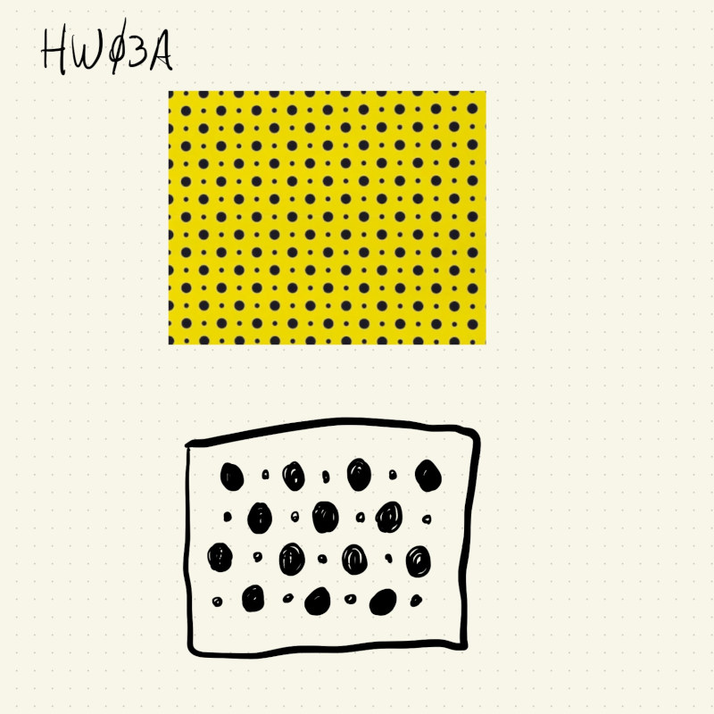
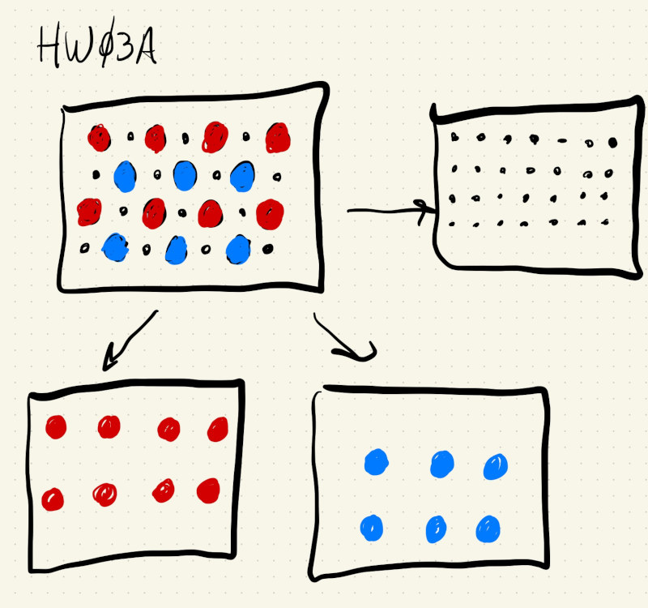
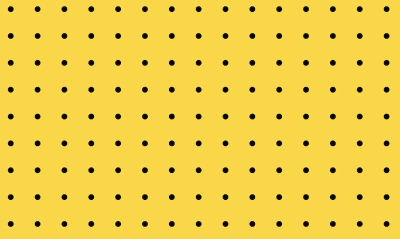
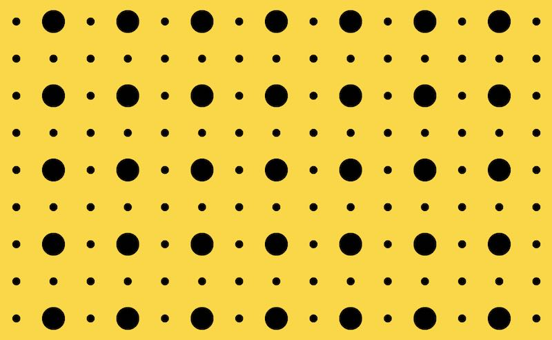
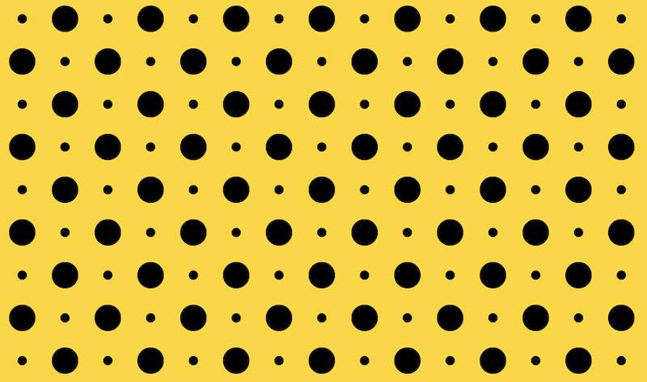

# HW03A

This is a sketch that replicates a Yayoi Kusama inspired pattern:



This pattern isn't completely regular: it has multiple sizes of circles and there's an offset between adjacent rows/columns. This is kind of like a checkerboard where adjacent rows start with alternating colors for their first square.

I think it's possible to draw this using a set of nested for loops and the modulo operator (%) to keep track of odd/even rows and odd/even columns, but the easiest and most straightforward way was to split up the pattern into 3 patterns can be drawn on top of each other, like this:



First I draw the small circles in a completely regular grid:

```
for (let x = 0; x < width; x += 5 * diamSmall) {
  for (let y = 0; y < height; y += 5 * diamSmall) {
    ellipse(x, y, diamSmall, diamSmall);
  }
}
```




Then, I drew the first set of the larger circles at every other row and every other column (in the image below it looks like it's every odd column and every even row):

```
for (let x = 0; x < width; x += 2 * 5 * diamSmall) {
  for (let y = 0; y < height; y += 2 * 5 * diamSmall) {
    ellipse(x, y, diamLarge, diamLarge);
  }
}
```




And finally, the last set of circles is exactly like the second, but with an offset of one column to the right and one row down:

```
translate(5 * diamSmall, 5 * diamSmall);
for (let x = 0; x < width; x += 2 * 5 * diamSmall) {
  for (let y = 0; y < height; y += 2 * 5 * diamSmall) {
    ellipse(x, y, diamLarge, diamLarge);
  }
}
```

